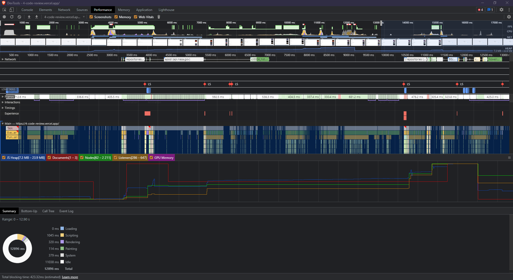

# 4-Code-Review (GitHub Repo Search App)

> A client-side application that queries the GitHub API with a little bit of NASA imagery sprinkled on top.

## [:fire: Deployed HERE :fire:](https://4-code-review.vercel.app/) -  

## DEMO:


## Built with:

-   [TypeScript](https://www.typescriptlang.org/) - Language used for the project.
-   [React.js](https://nodejs.org/en/) - JavaScript Framework.
-   [Next.js](https://nextjs.org/) - React Framework.
-   [Ant Design](https://ant.design/) - Design system / Components lib.
-   [Redux Toolkit](https://redux-toolkit.js.org/) - State & services/API management.
-   [Styled-Components](https://styled-components.com/) - CSS-in-JS solution.
-   [GitHub API](https://docs.github.com/en/rest) - Used to query repos, issues and stuff alike.
-   [NASA APOD API](https://github.com/nasa/apod-api) - Used to query images.

## Installation

_Make sure to have [Git](https://git-scm.com/) and [Node.js](https://nodejs.org/) 10.0.0 (or higher) installed._

1. Clone it or fork it.

2. Once you have your local copy, install its dependencies with a package manager (here we're going to be using npm):

```
npm install
```

_Alternatevely you can use [pnpm](https://pnpm.io/), the package manager used to create this project._

3. (OPTIONAL) Get yourself a [NASA API key](https://api.nasa.gov/) or use my own (available upon request @ gfmaximo97@gmail.com).

4. Create a `.env` file with the following properties:

```
NEXT_PUBLIC_GITHUB_SEARCH_ENDPOINT=* (E.g.: https://api.github.com/search/)
NEXT_PUBLIC_NASA_PLANETARY_ENDPOINT=* (E.g: https://api.nasa.gov/planetary/)
NEXT_PUBLIC_NASA_APOD_KEY=*
```

_The planetary endpoint could very well be fixed. However, setting all endpoints on `.env` is a project pattern I impose._

## Running

After having installed the dependencies and having configured `.env`, you can then build the application with:

```
npm run build
```

Then after the build is done, start the application with:

```
npm run start
```

_This will start the server at `localhost:3000`_

## Testing

This project uses [Cypress](https://www.cypress.io/) to automate end-to-end tests.

All the test cases were written and configured on `cypress/integration`.

Before testing, make sure that you have configured the `cypress.json` file with the following parameters:

-   port - Port where the application runs (default is 3000).
-   githubSearchEndpoint - GitHub's search API (E.g.: https://api.github.com/search/).
-   nasaPlanetaryEndpoint - NASA's API with access to the APOD microservice (E.g: https://api.nasa.gov/planetary/)
-   (OPTIONAL) projectId - Id of the project for monitoring and integration with Cypress services, it's registered on my account (@ gfmaximo97@gmail.com), you can choose to leave it or delete it. Makes no difference.

```
    {
        "projectId": "p21ze9",
        "env": {
            "port": "3000",
            "githubSearchEndpoint": "https://api.github.com/search/",
            "nasaPlanetaryEndpoint": "https://api.nasa.gov/planetary/"
        }
    }
```

Also, make sure that the port you have set on `cypress.json` matches the ports set on the `package.json` scripts and that you have previously set the `NEXT_PUBLIC_NASA_APOD_KEY` property on `.env`.

After having configured everything, you can run the tests with:

```
npm run e2e
```

or if you want to run it solely on the console:

```
npm run e2e:headless
```

## Performance

_Performance metrics were measured with the help of [DevTools Lighthouse](https://developers.google.com/web/tools/lighthouse/) & [Vercel Analytics](https://vercel.com/analytics)._

#### Overall Lighthouse score of the `/` page:


#### Overall Lighthouse score of the `/search` page:


#### Detailed performance snapshot of the entire flow of the app:



#### Vercel desktop performance analytics:


#### Mobile performance analytics:


#### Performance by page:


_These are small samples collected with a very limited number of devices, the real performance scores may differ for better or for worse._

## Mobile & PWA

This project supports PWA:


#### Mobile responsiveness:


## CI/CD

### CI

Continuous Integration is done using [GitHub Actions](https://github.com/features/actions) together with Cypress, you can check out the project's runs @ its [Cypress Dashboard](https://dashboard.cypress.io/projects/p21ze9/).

### CD

Continuous Delivery is done using [Vercel for GitHub](https://github.com/apps/vercel).

## Security

Project security oversight is done by [Snyk](https://snyk.io/).
Good doggo, barks whenever there's a security issue and bites the hell out of vulnerabilities.

_As of right now there is only one known vulnerability in the project caused by [next-pwa](https://www.npmjs.com/package/next-pwa), Snyk does not have a fix for it yet. So if you want to hack the project, I just gave you a clue..._

## Known issues

-   [NASA's APOD API is somewhat slow and will sometimes throw 504 GATEWAY_TIMEOUT.](https://github.com/nasa/apod-api#api-reliability)
-   NASA's APOD API video results that are hosted on 'https://apod.nasa.gov/' won't play because they set 'X-Frame-Options' to 'sameorigin'.
-   [Next.js will sometimes give a server-side warning about Ant Design trying to use useLayoutEffect under the hood.](https://github.com/ant-design/ant-design/issues/30396)
-   Offline fallback on PWA with [next-pwa](https://www.npmjs.com/package/next-pwa) SUCKS. There are various issues on their repo about this and I couldn't get it to work properly myself. Maybe in the future I'll open an issue there. For now having an illustration on the `/search` page is enough for me.

## Things to keep in mind for further development

-   Pages must have .page.tsx exention.
-   Do not create `./components` level components unless you plan to use them in more than one page or component.
-   Texts are stored in `texts` object variables with alphabet letters as key and text as value, it sucks but I haven't found anything better yet. Alternative pattern suggestions are welcome.
-   As mentioned previously above, all endpoints must be declared on the `.env` file.
-   Testing could be better, the project lacks unit testing and has extremely limited coverage of edge cases by the current integration/e2e testing done with Cypress.
-   Commits must be done following [Conventional Commits](https://www.conventionalcommits.org/en/v1.0.0-beta.2/).
-   If more than one person ever works in this project, ideally I would prefer that all GIT management be done following [Trunk-based development](https://www.atlassian.com/continuous-delivery/continuous-integration/trunk-based-development).
-   Cypress CI queries for a `package-lock.json` that matches the project's `package.json` during the CI build phase. Meaning that, while you could use pnpm and yarn to manage dependencies, you'll always have to make sure that the project's `package-lock.json` is up to date. It's a hassle to the point it made me abandon pnpm/yarn and just use npm instead.
-   There should be a skeleton of the layout during loading and page transitions. Or at least a loading spinner on all loading items.

## Things to keep in mind for auditing

-   Brave Browser and other privacy-oriented browsers will block stuff from NASA's embedded videos, filling up the console with "blocked by client" errors.
-   Chromium-based browsers with autofill enabled will warn about "Audit usage of navigator.userAgent, navigator.appVersion, and navigator.platform". I haven't found which package causes this.

## Useful links that weighed heavily on key technical decisions / Project direction & patterns.

-   [Why would I need to freeze an object in JavaScript?](https://stackoverflow.com/q/14791302/10088643)
-   [Any performance benefit to "locking down" JavaScript objects?](https://stackoverflow.com/q/8435080/10088643)
-   [When should you NOT use React memo?](https://stackoverflow.com/questions/53074551/when-should-you-not-use-react-memo)
-   [Premature optimization is the root of all evil | Donald Knuth and Lex Fridman
    ](https://youtu.be/74RdET79q40)

